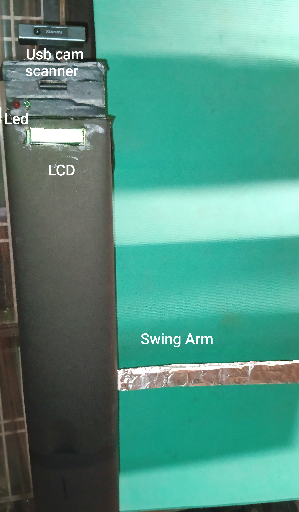

Aeropass Gate controller  
====================

Interacts with peripherals and let PAX pass through as per biometric enrollments.

## MVP Version Hardware
- ARM SOC 
- Servo <12 V
- Leds
- LCD
- USB Camera
- MIC
- PIR

## Lite Version Hardware
- ARM SOC
- Wooden/Steel Fabricated
- BLDC
- Limit Switches
- Relays
- PIR Sensors (Anti tailgate and PAX detection)
- USB Cam
- LEDs
- LCD
- MIC(Accessibility) /Buzzer(Scan/Error alerts)

## Features

- **Peripheral Management**: Controls GPIO peripherals including LEDs, LCDs, servos, and various sensors.
- **Barcode Scanning**: Utilizes a USB camera to scan boarding pass barcodes.
- **AeroPass Server Integration**: Connects to an external AeroPass server to validate the passenger's PNR and facial data.
- **Biometric Verification**: Captures and matches the passenger's facial data against the server’s records.
- **Automated Gate Control**: Opens the gate by moving motors and turning the LED green when verification is successful.

## Software

- Egate controller interacts with above peripherals 
- Written in Python
- Fully customizable peripheral service , new sensors/motors can be added on SOC on demand.
- Fully extendible controller to support any kind of airport systems(DCS/SBDs)

Version 1.0
===========

## Wiring setup MVP Version

